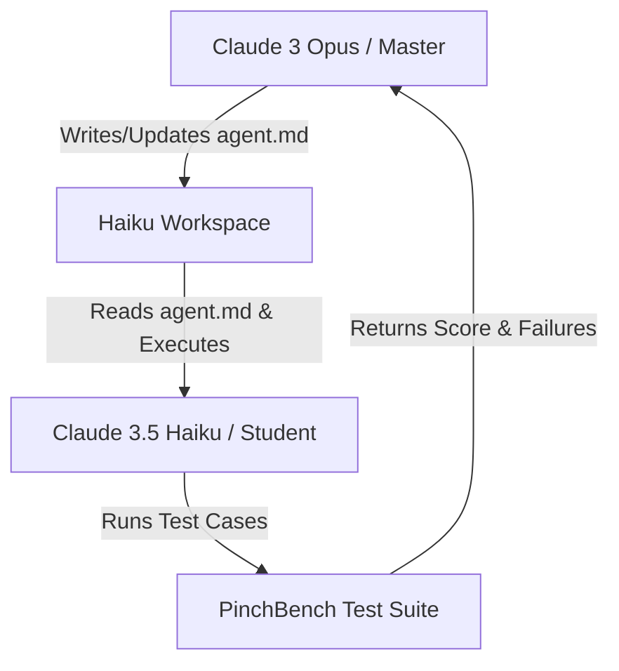

# Comprehensive Guide: Harness Engineering & Natural Language Harnessing

- **Video URL:** [YouTube Link](https://www.youtube.com/watch?v=R6fZR_9kmIw)
- **Watch Skill ID:** `579c8e471aee536c`
- **Category:** #ai-agents
- **Date Processed:** 2026-07-11
- **Duration:** 01:32:20

---

## 1. Defining Harness Engineering
The term **Harness** (traditionally meaning "dây cương" or "steering reins") refers to the surrounding framework, system instructions, environments, and tool specifications that guide and restrict an LLM's actions.
- **Core Philosophy:** "Sometimes a language model is not limited by its intelligence, but rather by the lack of a proper Harness to guide it." (有時候語言模型不是不夠聰明，只是沒有人類好好引導).
- **Harness Engineering (or Harness Design):** The systematic engineering of prompts, system contexts, execution rules, and file configurations (like `agents.md`) to guide an AI agent safely and efficiently. A true harness must have enforcement power over the model's behavior.

---

## 2. Natural Language Harness: The `agents.md` File
An `agents.md` file acts as a repository-level Natural Language Harness. When an agent enters a repository, it is instructed to read `agents.md` first before making any edits.

### Key Rules for Writing a Good `agents.md`
- **It is a Map, not an Encyclopedia:** A good `agents.md` should act as a map ("一張地圖") that shows the agent where files are, what tools to use, and how to verify changes. Do not overload it with every piece of codebase information (which consumes context and causes hallucinations).
- **Provide Actionable Guidelines:** Document coding standards, verification commands (like `pytest` or `npm run test`), and strict directory policies.
- **Human-written vs. LLM-written:** Research shows human-written `agents.md` guidelines yield the highest task success rate and fastest execution speed. When an LLM generates its own `agents.md` from scratch, it often overfits to the current task and degrades performance in subsequent tasks.

---

## 3. Case Study: Opus-Haiku PinchBench Experiment
The speaker described a real experiment testing the power of automated Harness optimization using two models: a master model **Claude 3 Opus** (referred to as "小金") and a student model **Claude 3.5 Haiku**.

### The Setup
- **Target:** Get Claude 3.5 Haiku to complete software tasks (debugging, files, email processing) on **PinchBench** (an AI Agent benchmark).
- **Baseline (Round 0):** Haiku took the benchmark with no `agent.md` file in its workspace ("裸考"). It scored a very low **13.5** out of 100.
- **Autonomous Training Loop:** The speaker gave a single high-level instruction to Opus: *"Your goal is to guide the student AI (Haiku) to perform better. Analyze its failures and update its agent.md file."*

### Round 1 Optimization: Output Location
- **Discovery:** Opus analyzed the logs and found that Haiku was successfully solving the coding challenges but outputting the correct code in the chat text box instead of writing it to the actual file on disk. In PinchBench, this gets zero points.
- **Action:** Opus wrote an instruction into `agent.md`: *"You must write the corrected code directly to the file on disk. Outputting it in the chat has no value."*
- **Result:** Haiku's score skyrocketed from **13.5** to **57.9** in the next round.

### Round 2 Optimization: Timeout Prevention
- **Discovery:** Opus noticed that Haiku got stuck or failed because it paused to ask for clarifications/explanations from the user (e.g. "Should I proceed?"). In an automated benchmark, stopping to wait for user input leads to immediate timeout and failure.
- **Action:** Opus added an instruction to `agent.md`: *"All necessary information has been provided. Do not stop to explain or ask for clarifications. Execute the task all the way to the end."*
- **Result:** Haiku's score improved further, demonstrating that a stronger model can successfully engineer and iterate on a Harness for a smaller model.

---

## 4. Evaluation Pitfalls: ToolBench AI-to-AI Interactions
The video also discusses **ToolBench** (a benchmark evaluating customer support agents using tools to read backend data).

- **The Common Practice:** To evaluate agents, developers often have one AI agent play the role of the "customer support agent" and another AI play the "customer".
- **The Issue:** AI-to-AI evaluations significantly **overestimate** agent success rates. AI customers are patient, structured, and speak in logical sentences, which matches the agent's context perfectly.
- **The Reality:** When evaluated against real human customers, agent success rates drop dramatically. Humans are emotional, unstructured, write short/ambiguous phrases, and skip steps.
- **The Evaluation Gap:** The biggest gap between AI-AI and AI-Human interactions lies in the "humanlike" dimension. Modern benchmarks use frontier models (like GPT-5.1) to act as a judge to score the agent's overall interaction flow, tone, and tool reuse.

---

## 5. Useful Search Keywords
- `harness engineering`, `agents.md`, `pinchbench`, `toolbench`, `opus haiku experiment`, `meta-harness`

*Run: `watch-skill search "<keyword>"` to query this video and others in your vault.*
