# ASP.NET Core Deep-Dive in .NET 11 (8 Hours Masterclass)

- **Video URL:** [YouTube Link](https://www.youtube.com/watch?v=E-RPvJnMBLU)
- **Watch Skill ID:** `1ec0ace8cc80df05`
- **Category:** #dotnet / #web-development
- **Date Processed:** 2026-07-27
- **Duration:** 08:06:00

---

## 1. Executive Summary & Scope
Despite the broad title indicating a full ASP.NET Core coverage, this 8-hour comprehensive tutorial is a **highly focused, step-by-step masterclass** covering the foundational plumbing of ASP.NET Core (.NET 11) web applications. 
- **The Core Focus:** Minimal APIs, the Kestrel web server, Custom Middleware pipelines, Routing constraints, Model Binding, and Clean Code refactoring using C# Extension Methods.
- **Methodology:** The instructor explains concepts slowly, writes code line-by-line, runs endpoints in Postman, and draws architectural diagrams of HTTP request/response flows.

---

## 2. Comprehensive Module Timeline

```mermaid
gantt
    title ASP.NET Core .NET 11 Timeline (8 Hours)
    dateFormat  X
    axisFormat %Hh
    section Modules
    Minimal APIs & CRUD Basics     :active, 0, 90
    Middleware Pipeline            :active, 90, 195
    Dependency Injection Basics    :active, 195, 240
    Routing & Constraints          :active, 240, 330
    Model Binding & Sources        :active, 330, 420
    Custom IResult & Responses     :active, 420, 465
    Clean Code Refactoring         :active, 465, 486
```

### 1. Minimal APIs & CRUD Basics (00:00 - 01:30)
* **Kestrel Fundamentals:** Explains how Kestrel acts as the web server, receiving raw HTTP request strings and parsing them into C# `HttpContext` objects.
* **Basic CRUD Operations:** Implementing endpoints (`MapGet`, `MapPost`, `MapPut`, `MapDelete`) to handle employee records.
* **In-Memory Storage:** Writing an in-memory repository to store objects without database setup to focus purely on API lifecycle.
* **Request Lifecycle:** Reading the HTTP Request Body and returning appropriate HTTP Status Codes (e.g. `201 Created` vs `200 OK`).

### 2. The Middleware Pipeline (01:30 - 03:15)
* **Pipeline Execution Flow:** Detailed breakdown of how the Kestrel request pipeline executes middleware sequentially and returns responses in reverse order.
* **Custom Middleware:** Step-by-step implementation of custom middleware classes to handle cross-cutting concerns like logging and URL redirection.
* **Branching Pipelines:** Using `Map` and `MapWhen` to conditionally execute specific middleware chains based on the request URL.

### 3. Dependency Injection (DI) Basics (03:15 - 04:00)
* **Concept:** Introduction to the built-in IoC (Inversion of Control) container in ASP.NET Core.
* **Service Lifetimes:** Explaining the difference between:
  - `Transient` (created every time they are requested).
  - `Singleton` (created once and shared globally).
  - `Scoped` (created once per HTTP request lifecycle).
* **Usage:** Registering the repository service as `Transient` (`builder.Services.AddTransient<IRepository, MyRepository>()`) and injecting it into Minimal API endpoints.

### 4. Routing & Constraints (04:00 - 05:30)
* **Route Templates:** Creating dynamic endpoints with parameters (e.g., `app.MapGet("/employees/{id}")`).
* **Route Constraints:** Restricting parameter types to prevent routing conflicts (e.g., `app.MapGet("/employees/{id:int}")` or `app.MapGet("/employees/{name:alpha}")`).
* **Defaults & Optionals:** Defining optional route parameters (`{id?}`) and default values.
* **Case-Sensitivity:** Understanding route matching options.

### 5. Model Binding & Sources (05:30 - 07:00)
* **Binding Mechanics:** How ASP.NET Core maps incoming request data to handler parameters.
* **Explicit Binding Sources:** Specifying where data should be extracted from:
  - `[FromBody]` (request body).
  - `[FromRoute]` (URL path parameters).
  - `[FromQuery]` (URL query parameters).
  - `[FromHeader]` (HTTP headers).
  - `[FromServices]` (dependency injection services).
* **Validation:** Checking parameter presence, null validations using C# pattern matching (`employee is not null`), and query string parsing.

### 6. Custom IResult & Responses (07:00 - 07:45)
* **Response Customization:** Building proper HTTP response structures.
* **Writing Custom `IResult`:** Implementing the `IResult` interface to create custom response outcomes, such as returning raw HTML string responses (`HtmlResult`) or custom data envelopes.

### 7. Clean Code & Extension Methods Refactoring (07:45 - 08:06)
* **The Bloat Problem:** As APIs grow, registering dozens of Minimal APIs directly in `Program.cs` makes the file unreadable and unmaintainable.
* **The Extension Method Fix:**
  - Creating a static class (e.g., `EmployeeEndpoints`).
  - Writing an extension method extending `IEndpointRouteBuilder` (e.g., `public static IEndpointRouteBuilder MapEmployeeEndpoints(this IEndpointRouteBuilder app)`).
  - Cutting and pasting all endpoint mapping logic into this method.
  - Keeping `Program.cs` clean by simply calling `app.MapEmployeeEndpoints()`.

---

## 3. Key C# & .NET 11 Features Covered
* **Minimal API Endpoint Mapping (`app.MapGet`, etc.)**
* **C# Extension Methods** (extending `IEndpointRouteBuilder` to clean `Program.cs`).
* **C# Pattern Matching** (null checking via `is not null`).
* **Built-in Dependency Injection Lifetimes** (`AddTransient`, `AddSingleton`).
* **Custom `IResult` implementations.**

---

## 4. Useful Search Keywords
- `minimal api routing dotnet 11`, `kestrel middleware pipeline`, `custom IResult html`, `endpoint routing constraints`, `refactoring program cs extension methods`

*Run: `watch-skill search "<keyword>"` to query this video and others in your vault.*
