# Comprehensive Study Guide: Claude Certified Associate - Foundation (CCA-F)

- **Video URL:** [YouTube Link](https://www.youtube.com/watch?v=kY9z4hiH4nk)
- **Watch Skill ID:** `c4f8d23d5d2fdc59`
- **Category:** #certification / #anthropic-claude
- **Date Processed:** 2026-07-11
- **Duration:** 15:50

---

## 1. Executive Summary & Why it Matters
The **Claude Certified Associate - Foundation (CCA-F)** (also referred to as the Claude Architect Certification Exam) is the **first official AI certification in the world** issued by a frontier model laboratory (Anthropic). 
- **Significance:** Demonstrates enterprise-grade capability in implementing and designing real-world Claude-based AI systems. Essential first step for organizations aiming to become official Anthropic/Claude implementation partners.
- **Format:** 120 minutes, 60 multiple-choice questions (approx. 2 minutes per question).
- **Cooling-off Period:** If you fail the exam, you must wait **6 months** before retaking it.
- **Difficulty:** High. It mimics SAT-style comprehension, requiring candidates to read complex developer scenarios and apply specific technical constraints, prompt engineering principles, and model parameters.

---

## 2. Exam Domain Breakdown
The exam is structured across five core domains:

| Domain | Weight | Core Focus |
|--------|--------|------------|
| **Agentic Architecture & Orchestration** | 27% | Designing multi-agent workflows, sub-agent coordination, routing, and task delegation. |
| **Claude Code Configuration & Workflows** | 20% | Integration of Claude Code, CI/CD automated review pipelines, and developer workflows. |
| **Prompt Engineering & Structured Output** | 20% | System prompts, XML tagging, few-shot examples, JSON formatting, and steering model behaviors. |
| **Tool Design & MCP Integration** | 18% | Designing robust tools, handling schemas, error states, and Model Context Protocol (MCP) servers. |
| **Context Management & Reliability** | 15% | Handling context windows, system tokens, caching, recovery from failures, and rate limits. |

---

## 3. The 2-Day (20-Hour) Ultimate Study Strategy
If you have a strong background in AI systems, you can prepare in 2 days (10 hours per day). Otherwise, extend this to 1-2 weeks.

```mermaid
gantt
    title CCA-F 2-Day Preparation Plan
    dateFormat  X
    axisFormat %d
    section Day 1: Theory (10h)
    SkillJar Courses           :active, 0, 8
    Official Study Guide       :active, 8, 10
    section Day 2: Practice (10h)
    Cert Safari Questions      : 10, 13
    Official Practice Exam     : 13, 16
    Cloud Certification Guide  : 16, 18
    Mock Exam Site Practice    : 18, 20
```

### Day 1: Foundation and Official Documentation (10 Hours)
1. **SkillJar Courses (~8 Hours):** Log in to the official Anthropic SkillJar and complete the following 4 courses:
   - **Claude Code in Action**
   - **Introduction to Model Context Protocol (MCP)** *(Note: The lectures here are identical to the MCP sections in the Building with Claude API course. You can skip watching it twice, but make sure to click through and complete the quiz).*
   - **Introduction to Agent Skills**
   - **Building with Claude API** *(This is the longest course, taking ~6 hours. You can watch the videos/notes instead of executing the Jupyter/Python notebooks if you want to save time).*
2. **Official Anthropic Study Guide (~2 Hours):** Speed-read the entire official guide. Take detailed notes on specific technical limits, model parameters, and micro-facts. Complete the 12 practice questions at the end of the guide.

### Day 2: Test Familiarization and Mock Exams (10 Hours)
1. **Cert Safari (50-80 Questions):** Work through Cert Safari (AI-generated questions based on the study guide) to get used to how questions are framed.
2. **Official Practice Exam:** Take the full official practice exam. **Warning:** The official practice questions are **about 1/3 easier** than the real exam. Retake this test until you score at least **90% (54/60)**.
3. **Cloud Certification Guide & Common Traps:** Review common pitfalls, edge cases, and domain traps.
4. **Mock Exam Site (60 Questions):** Complete 60 mock questions. This site has questions that are closest in format and difficulty to the actual exam.

---

## 4. Deep-Dive Analysis of Sample Questions
Here is an in-depth breakdown of three specific exam scenarios discussed in the video, illustrating the reasoning patterns required to pass the exam.

### Question 1: Continuous Integration Review Restructuring
* **Scenario:** You are integrating Claude Code into a CI/CD pipeline. A Pull Request (PR) modifies 14 files across a stock tracking module. Running a single-pass review on all files together produces inconsistent results: detailed feedback on some files, superficial comments on others, obvious bugs missed, and contradictory feedback (approving a pattern in one file but flagging it as problematic in another).
* **Question:** How do you restructure the review?
* **Options:**
  - *A. Switch to a higher-tier model.*
  - *B. Run three independent review passes on the full PR.*
  - *C. Split into focused passes: analyze each file individually for local issues, then run a separate integration-focused pass examining cross-file data flow.*
  - *D. Require developers to split large PRs into smaller submissions of three or four files.*
* **Correct Answer:** **C**
* **Rationale:**
  - **Why C is correct:** Running all 14 files in a single pass overloads the model's attention, causing detailed/superficial inconsistencies and missing cross-file integration issues. Splitting the process separates local file checking (low-context, highly focused) from integration checking (high-context, looking at relationships), which matches engineering best practices.
  - **Why others are wrong:** Switching models (A) doesn't solve attention dilution. Running three full passes (B) wastes tokens and yields the same inconsistent behavior. Splitting PRs (D) places an unnecessary burden on developers and doesn't solve the core architectural issue of how files are processed.

### Question 2: Multi-Agent Research System Error Handling
* **Scenario:** You have a multi-agent research system that delegates tasks to sub-agents (web search, document analysis, report generation). The document analysis sub-agent frequently encounters failures when processing PDF files (corrupted files, password protection, timeouts on large files). Currently, any exception immediately terminates the sub-agent and returns an error, forcing the coordinator agent to handle it, leading to excessive coordinator involvement.
* **Question:** What is the most effective architectural improvement?
* **Options:**
  - *A. Create a dedicated error handling agent.*
  - *B. Have the coordinator validate all documents before handing them over.*
  - *C. Implement local recovery for transient failures.*
  - *D. Configure the sub-agent to always return partial results with a success status.*
* **Correct Answer:** **C**
* **Rationale:**
  - **Why C is correct:** Transient failures (like network timeouts) should be recovered locally (e.g., retries) within the sub-agent to prevent polluting the coordinator's context. The sub-agent should only bubble up permanent/fatal errors (like corrupted or password-protected files).
  - **Why others are wrong:** Creating an error-handling agent (A) adds unnecessary complexity. Making the coordinator validate files (B) violates the separation of concerns. Returning partial results with a "success" status (D) hides errors instead of resolving them, leading to silent failures.

### Question 3: Customer Support Resolution Reliability
* **Scenario:** A customer support resolution agent has access to MCP tools: `get_customer`, `lookup_order`, `process_refund`, and `escalate_to_human`. Production data shows that in 12% of cases, the agent skips `get_customer` entirely and calls `lookup_order` using only the customer's stated name, leading to misidentified accounts and incorrect refunds.
* **Question:** What change would most effectively address this reliability issue?
* **Options:**
  - *A. Enhance the system prompt to state that customer verification is mandatory.*
  - *B. Implement a routing classifier.*
  - *C. Add a programmatic prerequisite that blocks lookup_order and process_refund until get_customer has returned a verified customer ID.*
  - *D. Add a few-shot example showing the agent always calling get_customer first.*
* **Correct Answer:** **C**
* **Rationale:**
  - **Why C is correct:** Prompting (A) and few-shot examples (D) are probabilistic and cannot guarantee 100% compliance; models can still bypass them in edge cases. A programmatic lock/prerequisite is **deterministic**, ensuring that tools modifying states or retrieving orders cannot physically execute without a valid customer ID session.
  - **Why others are wrong:** Prompts (A) and few-shots (D) do not offer deterministic guarantees. A routing classifier (B) is unrelated to enforcing step-by-step tool dependencies.
